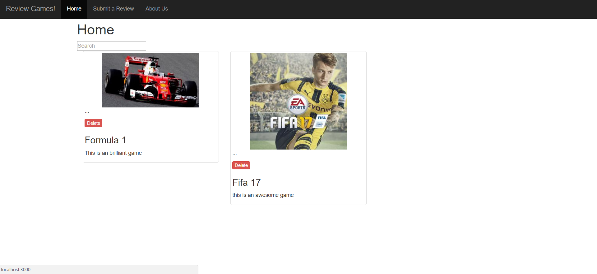
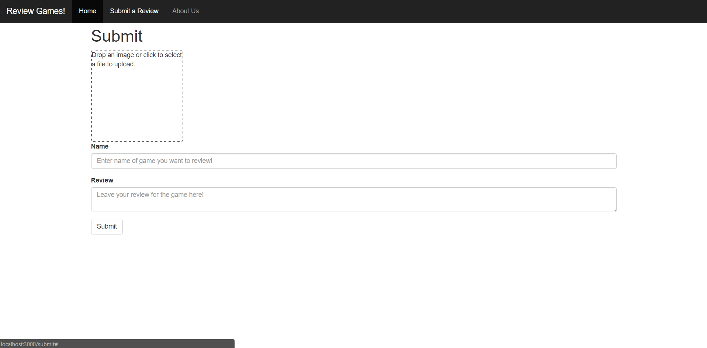
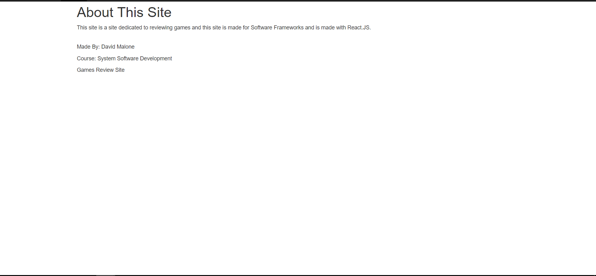

# Assignment 1 - ReactJS App Game Review Site.

Name: David Malone

## Overview.
This application was built with ReactJS for Software Frameworks module.  This application is a games review site where people can upload images, review games and search through games on the site through the search box.  I got the idea for this site because I built a similar site last year in a previous module with Ruby, I thought i would like to build a similar app using React.  This application is using cloudinary to upload and store the images.  I am also using local storage to store the reviews once saved.  I also have a seed in so that when someone opens the website if nothing is added one review will get added automatically.

## Installation requirements.
. . . .  List of software used to develop the app . . . . . . . 
+ ReactJS v15.3.0
+ Bootstrap 3
+ create-react-app tool
+ Cloudinary to handle the image uploading and the image storage.  Also to display 	the image.
+ React DropZone was used to pass the image to Cloudinary.

when you download the application you will first need to npm install and then npm start.  There should be a default game in there loaded up from the seeds and you can browse through the pages.

## Data Model Design.

My Data model is rather straight forward there is a game name, review and image, the image is just a link directing to a cloudinary account.  

## App Component Design.

A diagram showing the app's hierarchical component design (see example below). 

## UI Design.

My UI design is rather straight forward there is a Submit, View all Reviews and an About page.  Below is a screenshot of each page.

  
  
  
 

## Routing.
. . . . List each route supported and state the associated view . . . . . 

+ Home: This is the page where you can view all the views on the website and also delete a review.
+ Submit: This is the submit router/view and this is where you can submit your review and upload the image of the game.
+ About Us: This is a description of the site/purpose.

## Extra features

The extra feature that was put in for the app was the third party api DropZone which is used to upload the images and my Cloudinary account is connected to the website and all stored images are stored in my cloudinary account. 

There is a search function for user to search all reviews.   

There is a delete funciton for users to delete games.

There is also the abiliity for users to add reviews and titles.
## Independent learning.

I reserached how to use/store images on the site.   I also researched how to use local storage with the web application to store the reviews.  I also added the search function.

  
  
  
    

 

